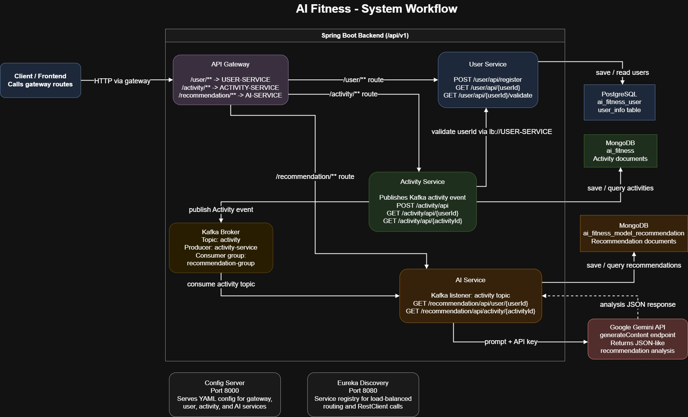
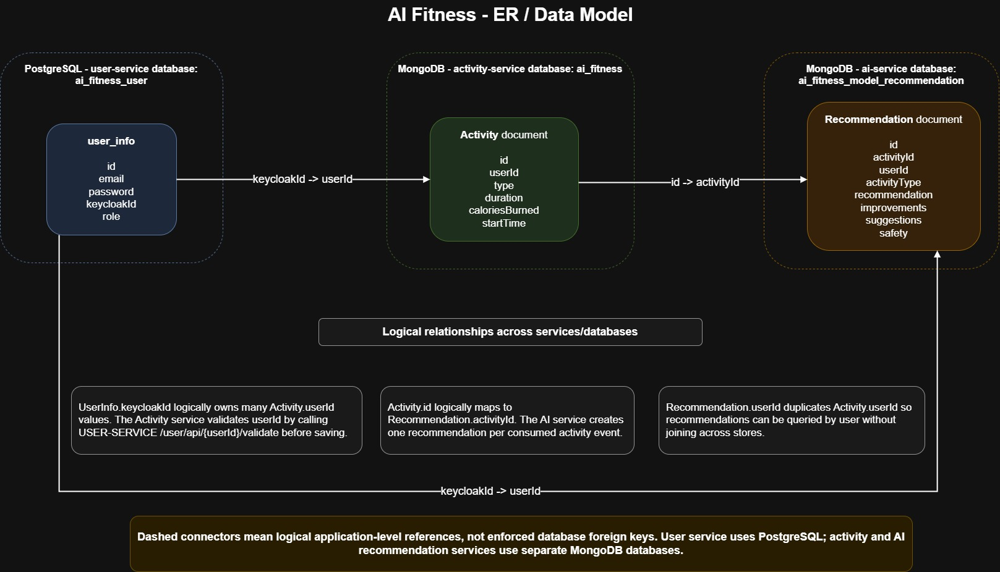

# AI Fitness Platform – Microservices Backend

[](https://openjdk.org)
[](https://spring.io/projects/spring-boot)
[](https://www.postgresql.org/)
[](https://www.mongodb.com/)
[](https://kafka.apache.org/)
[](https://www.docker.com/)

**AI Fitness Platform** is a microservices-based backend system built with Java and Spring Boot. It provides user management, fitness activity tracking, and AI-driven recommendations. The architecture leverages Spring Cloud (Eureka, Config Server, API Gateway), event-driven messaging via Apache Kafka, and a mix of relational (PostgreSQL) and NoSQL (MongoDB) databases.

## Features

| Category               | Details                                                                                |
|:-----------------------| :---------------------------------------------------------------------------------------|
| **User Management**    | Handles user profiles and authentication via the User Service.                         |
| **Activity Tracking**  | Logs and manages user fitness activities using the Activity Service.                   |
| **AI Recommendations** | Generates personalized fitness insights using the AI Model Service.                    |
| **Service Discovery**  | Dynamic service registration and discovery via Netflix Eureka.                         |
| **Centralized Config** | Manages application configuration externally via Spring Cloud Config Server.           |
| **API Gateway**        | Routes all external requests to appropriate internal microservices.                    |
| **Event-Driven Comm.** | Asynchronous communication between services using Apache Kafka.                        |
| **Data Persistence**   | Uses PostgreSQL for structured user data and MongoDB for flexible activity records.    |
| **Docker Compose**     | Full orchestration of all microservices and databases for local development.           |

---

## Tech Stack

| Layer                    | Technology                                                       |
| :-------------------------| :-----------------------------------------------------------------|
| Language                 | Java 21                                                          |
| Framework                | Spring Boot (Web, Data JPA, Data MongoDB)                        |
| Cloud Components         | Spring Cloud (Eureka, Config, API Gateway)                       |
| Relational Database      | PostgreSQL (User Service)                                        |
| NoSQL Database           | MongoDB (Activity Service, AI Service)                           |
| Message Broker           | Apache Kafka                                                     |
| Containerisation         | Docker & Docker Compose                                          |
| Build Tool               | Maven                                                            |

---

## Project Structure

The project follows a **microservices** architecture. Each service is independently deployable and manages its own data source.

```text
ai_fitness/
├── Api-gateway/            # Routes external requests to microservices
├── Config-Server/          # Centralized configuration management
├── Eureka/                 # Service Registry and Discovery
├── User/                   # User Service (PostgreSQL)
├── Activity/               # Activity Tracking Service (MongoDB, Kafka)
├── AIModel/                # AI Recommendation Service (MongoDB, Kafka)
├── docker-compose.yml      # Orchestrates services and infrastructure
├── pom.xml                 # Parent Maven POM
└── .env                    # Environment variables (e.g., API keys)
```

---

## System Workflow Diagram

<p align="center">
  
</p>

---

## Environment Variables

Create a `.env` file in the root directory to store sensitive credentials:

| Variable | Description | Example |
| :--- | :--- | :--- |
| `API_KEY` | API key required for the AI Model Service (e.g., Gemini API) | `AIzaSyB...` |

> **Note:** Database credentials and URLs are pre-configured in the `docker-compose.yml` for local development.

---

## Getting Started

### Prerequisites

- Java 21 JDK
- Maven 3.9+
- Docker and Docker Compose

---

### Run Locally with Docker

The easiest way to run the entire platform is using Docker Compose. It will automatically build the images and spin up PostgreSQL, MongoDB, Kafka, and all microservices.

```bash
# 1. Clone
git clone <repository-url>
cd ai_fitness

# 2. Create your .env file
# Create a .env file and add your API_KEY
echo "API_KEY=your_api_key_here" > .env

# 3. Build and Start Services
docker-compose up --build -d
```

### Accessing the Platform

Once all services are healthy, you can access the platform through the **API Gateway**:

```
http://localhost:8050
```

- **Eureka Dashboard**: `http://localhost:8080`

---

## Testing the API

The services expose various endpoints for managing users and activities. You can route your requests through the API Gateway on port `8050`.

**Quickstart flow:**

1. **User Registration** — create a new user profile via the User Service.
2. **Log Activity** — record a new fitness activity via the Activity Service.
3. **Get AI Insights** — request personalized recommendations based on logged activities.

> **Note:** All inter-service communication is handled internally via Eureka, and asynchronous events (like activity completion) are published to Kafka for the AI Service to process.

---

## ER diagram for models (DB Entity)
<p align="center">
  
</p>
